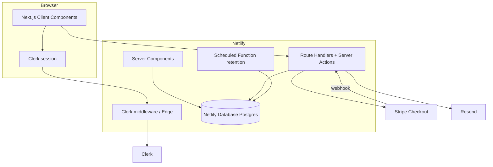

# Unsaid — Implementation Plan

**Status:** Locked for Netlify deployment  
**Stack:** Next.js App Router · Netlify · Netlify Database (Postgres) · Clerk · Stripe · Resend  
**Price:** $29 per couple, one-time · no subscription  
**Tagline:** Before you wed. Check Unsaid.

This plan is constrained by one rule: **everything we build must deploy on Netlify.**

Verified against Netlify docs:

- Next.js App Router, Route Handlers, Server Actions, Middleware — full support via OpenNext (zero-config; do not pin `@netlify/plugin-nextjs` unless required)
- Netlify Database — Postgres provisioned by `@netlify/database`; migrations in `netlify/database/migrations/`; preview deploys get isolated DB branches
- Secrets via Netlify env vars; use `Netlify.env.get` in Netlify Functions; Next.js server code uses standard env with vars set in Netlify UI/CLI

---

## 1. What we are building

Unsaid is a private, double-blind premarital compatibility check. Two people answer the same 96 questions independently. Neither sees the other’s answers. When both finish, the server compares answers (weighted by importance and hard lines) and surfaces conversations worth having—not a marry/don’t-marry verdict.

**The transaction that matters:**

> Your Unsaid is ready.  
> You have N conversations worth having.  
> Unlock for both · $29

---

## 2. Locked technical decisions

| Layer | Choice | Why |
| --- | --- | --- |
| Framework | **Next.js App Router** (15+) | First-class on Netlify OpenNext · SSR/SEO for landing + editorial pages · Route Handlers for APIs |
| Hosting | **Netlify** | Production target · auto Next adapter · DB branching |
| Auth | **Clerk** (`@clerk/nextjs`) | Passwordless email OTP · session in Middleware / `auth()` · no passwords |
| Database | **Netlify Database** (`@netlify/database`) | Hosted Postgres · auto provision · SQL migrations · preview branches |
| Answers | AES-256-GCM in DB · **server-only** reads | Never returned to partner clients |
| Payments | **Stripe Checkout** + webhook | Trust webhook, not client redirect |
| Email | Resend | Invite, reminder, ready, reveal |
| Monitoring | Sentry (PII scrubbed) | Errors without relationship content |
| Analytics | Privacy-safe event names only | No answers, topics, or mismatches |

**Rejected for this MVP (deploy friction / wrong fit):**

- Vite SPA + hand-rolled Netlify Functions as the app shell (weaker SEO, more glue)
- Supabase Auth (replaced by Clerk)
- Supabase Postgres (replaced by Netlify Database)
- Client-side scoring or partner-answer fetches

**Hard rules:**

1. Partner answers never leave the server in raw form.
2. Comparison runs once, server-side, when both participants complete.
3. Historical results store `algorithm_version` + `question_set_version` and are never silently recomputed.
4. Brand string is always `Unsaid` (never `UNSAID`, `unsaid.`, `UnSaid`).

---

## 3. Architecture



**Auth pattern:** Clerk Middleware protects app routes. Every Route Handler / Server Action calls `await auth()` from `@clerk/nextjs/server`, then queries Postgres with `getDatabase()` from `@netlify/database`. The browser never holds a DB connection string and never receives partner answers.

**API pattern:** Prefer **Next.js Route Handlers** under `app/api/**` (deployed as Netlify Functions by the OpenNext adapter). Use a **Netlify scheduled function** only for retention cleanup (Next has no native cron).

---

## 4. Repository layout

```
/
├── netlify.toml                 # build hints; keep minimal (Next auto-detected)
├── package.json
├── next.config.ts
├── middleware.ts                # clerkMiddleware (Next 15); proxy.ts if Next 16+
├── app/
│   ├── layout.tsx               # ClerkProvider, fonts, tokens
│   ├── page.tsx                 # Landing
│   ├── (auth)/
│   │   └── sign-in/[[...sign-in]]/page.tsx
│   ├── (app)/                   # authenticated shell
│   │   ├── dashboard/page.tsx
│   │   ├── checks/new/page.tsx
│   │   ├── checks/[id]/...
│   │   ├── assessment/[checkId]/page.tsx
│   │   ├── results/[checkId]/page.tsx
│   │   └── settings/page.tsx
│   ├── invite/[token]/page.tsx
│   ├── questions-before-marriage/page.tsx   # SEO
│   └── api/
│       ├── checks/route.ts
│       ├── checks/[id]/route.ts
│       ├── checks/[id]/invite/route.ts
│       ├── checks/[id]/checkout/route.ts
│       ├── checks/[id]/calculate/route.ts
│       ├── checks/[id]/remind/route.ts
│       ├── invitations/[token]/accept/route.ts
│       ├── responses/route.ts
│       ├── assessment/complete/route.ts
│       ├── results/[checkId]/route.ts
│       ├── results/[checkId]/[questionId]/reveal/route.ts
│       ├── stripe/webhook/route.ts
│       ├── account/route.ts
│       └── admin/...
├── components/                  # Button, Field, Progress, brand UI
├── features/                    # landing, assessment, results, etc.
├── lib/
│   ├── db.ts                    # getDatabase() wrapper
│   ├── auth.ts                  # requireUser() helpers
│   ├── crypto.ts                # AES-256-GCM + DEK wrap
│   ├── stripe.ts
│   ├── email.ts                 # Resend
│   ├── analytics.ts
│   └── offlineQueue.ts
├── content/
│   ├── questions/2026.09.json
│   ├── conversationPrompts.ts
│   └── copy.ts
├── shared/
│   ├── types.ts
│   ├── scoring.ts
│   ├── distances.ts
│   └── questionSet.ts
├── netlify/
│   ├── database/migrations/     # REQUIRED for schema
│   │   └── 001_init/.../migration.sql
│   └── functions/
│       └── retention-cleanup.mts   # scheduled only
└── docs/
```

---

## 5. Design system (unchanged product lock)

Tokens, Newsreader + Inter, wine/ivory palette, mobile-first 640px / results 960px, buttons 52px / radius 14px — as specified in the product lock. Implement in CSS variables + Next font loading (`next/font` for Inter; Newsreader via `next/font/google` or equivalent).

Landing: one composition, brand-led hero, `$29 per couple · No subscription` visible.

---

## 6. Clerk auth (MVP)

**Mode:** Email verification code (OTP). No passwords. Apple/Google later.

**Clerk Dashboard config:**

- Require email
- Sign-in / sign-up via email verification code
- Collect first name (Clerk + our `profiles` table)
- Optional preferred name / pronouns in our DB only
- 18+ confirmation stored in `profiles.age_confirmed_18`

**App wiring:**

- `ClerkProvider` in `app/layout.tsx`
- `clerkMiddleware()` in `middleware.ts`
- Custom branded sign-in UI (not a generic auth portal look) using Clerk custom flow or themed `<SignIn />`
- Server: `const { userId } = await auth()` — reject if missing
- On first authenticated visit: upsert `profiles` row keyed by `clerk_user_id`

**Do not require:** legal name, birthday beyond 18+, address, gender, phone.

---

## 7. Netlify Database

```bash
npm install @netlify/database
```

No manual connection-string setup. Provisioning happens on `netlify dev` / deploy.

```ts
// lib/db.ts
import { getDatabase } from "@netlify/database";

export function db() {
  return getDatabase();
}
```

Migrations live in `netlify/database/migrations/<number>_<slug>/migration.sql` and apply automatically before publish. Preview deploys get isolated DB branches.

**Access rule:** All reads/writes of responses, scoring, reveals, payments go through server code only. No browser SQL. No public Data API.

---

## 8. Data model (summary)

See [DATA_MODEL.md](./DATA_MODEL.md).

Core tables: `profiles`, `checks`, `check_participants`, `invitations`, `questions`, `responses` (encrypted), `results`, `result_items`, `reveals`, `payments`, `reminder_log`, `deletion_queue`.

`profiles.clerk_user_id` is the auth foreign key (text, Clerk user id).

---

## 9. Scoring

Unchanged algorithm — see [SCORING.md](./SCORING.md). Pure functions in `shared/scoring.ts`, unit-tested. Runs only in server Route Handlers after both participants complete.

---

## 10. API surface (Route Handlers)

| Method | Path | Purpose |
| --- | --- | --- |
| POST | `/api/checks` | Create check + participant A |
| POST | `/api/checks/:id/invite` | Create invitation (store token hash) |
| POST | `/api/invitations/:token/accept` | Partner B join |
| GET | `/api/checks/:id` | Safe check state for participant |
| POST | `/api/responses` | Upsert encrypted own answer |
| POST | `/api/assessment/complete` | Mark complete; trigger calc if both done |
| POST | `/api/checks/:id/calculate` | Idempotent compare |
| POST | `/api/checks/:id/checkout` | Stripe Checkout session |
| POST | `/api/stripe/webhook` | Set paid / unlocked |
| GET | `/api/results/:checkId` | Diffs only when unlocked (teaser counts when ready) |
| POST | `/api/results/:checkId/:questionId/reveal` | Mutual reveal state machine |
| POST | `/api/checks/:id/remind` | Rate-limited reminder |
| DELETE | `/api/checks/:id` | Soft-delete check |
| DELETE | `/api/account` | Full account wipe |

**Never exist:** endpoints that return partner answers without mutual reveal.

Stripe webhook verifies signature; sets `checks.unlocked_at` + `payment_status = paid`. Do not trust client redirect alone.

Checkout metadata: `check_id`, `purchasing_user_id` (Clerk id), `product_version`.

---

## 11. Primary user journeys

```
Person A                         Person B
Landing                          /invite/[token]
  → Clerk email OTP                → Privacy explainer
  → Create check                   → Clerk email OTP
  → Partner name + stage           → Accept invite
  → Share invite                   → Assessment (96)
  → Assessment (96)                → Waiting / Ready
  → Waiting                        → Pay or wait for A
  → Ready · $29 unlock
  → Results (both)
```

Critical funnel: **Start → Invite → Both complete → Pay**.

---

## 12. Phased delivery

### Phase 0 — Deployable foundation

- Scaffold Next.js App Router + TypeScript on Netlify (`next build`, publish `.next`, Node 18+)
- `netlify.toml` minimal; `.netlify` in `.gitignore`
- Install: `@clerk/nextjs`, `@netlify/database`, `stripe`, `zod`, `@tanstack/react-query`, `react-hook-form`
- Design tokens + fonts + Button primitives
- First migration: `profiles`, empty shell tables
- `lib/db.ts`, `lib/auth.ts`
- Prove: `netlify dev` serves app; Clerk sign-in works; DB query succeeds
- Env template documented (Clerk, Stripe, `ANSWER_MASTER_KEY`, Resend, Sentry, `NEXT_PUBLIC_SITE_URL`)

**Exit:** Linked Netlify site can deploy main and hit a health Route Handler that runs `SELECT 1`.

### Phase 1 — Landing + brand

- Hero + problem + how it works + privacy + final CTA (§41)
- Legal: 18+, not therapy disclaimer
- Analytics: `landing_viewed`, `start_clicked`
- LCP target ~2s mobile

### Phase 2 — Auth + profile

- Clerk OTP branded screens
- Profile upsert + first name + 18+
- Dashboard empty state
- Account deletion UI (wire fully in Phase 8)

### Phase 3 — Question bank + scoring

- Author `2026.09` bank (96 Q + prompts + matrices)
- `shared/scoring.ts` + distance unit tests
- Seed `questions` via migration or deploy seed script

### Phase 4 — Checks + invitations

- Create check, invite token (128-bit, hashed, 30-day)
- Web Share + copy link
- Accept invite for B; lock partner once B starts
- Resend invitation email
- Rate limits

### Phase 5 — Assessment

- Section intros, one question/screen, importance, hard lines
- Optimistic save + offline queue
- Waiting + reminder (1/24h)
- No score before both complete

### Phase 6 — Calculate + Stripe

- Server decrypt + score + write results → `ready`
- Ready paywall UI · Stripe Checkout · webhook unlock
- Emails: partner finished · results ready

### Phase 7 — Results + reveal

- Headline conversations count · Alignment Index · impact list
- Detail + prompts · mutual reveal · mark discussed · retake · share

### Phase 8 — Trust / abuse / a11y

- Deletion + 90-day retention scheduled function
- Rate limits, Sentry scrubbing, analytics allowlist
- WCAG AA pass

### Phase 9 — SEO + PWA + admin

- Editorial pages (§42)
- Installable PWA shell
- `/admin` metrics (no casual plaintext answer browse)

---

## 13. Explicit non-goals (MVP)

AI advice, chat, therapist marketplace, wedding planning, subscriptions, social profiles, community, dating matching, public scores, native apps, referral discounts, counselor product.

---

## 14. Env vars (Netlify)

```
NEXT_PUBLIC_CLERK_PUBLISHABLE_KEY
CLERK_SECRET_KEY
NEXT_PUBLIC_CLERK_SIGN_IN_URL=/sign-in
NEXT_PUBLIC_CLERK_SIGN_UP_URL=/sign-in
STRIPE_SECRET_KEY
STRIPE_WEBHOOK_SECRET
STRIPE_PRICE_ID              # $29 one-time
ANSWER_MASTER_KEY
RESEND_API_KEY
EMAIL_FROM
SENTRY_DSN
NEXT_PUBLIC_SITE_URL
ADMIN_EMAILS
```

Netlify Database connection is injected by the platform — do not hardcode. Stripe webhook endpoint on production URL must be registered in Stripe Dashboard.

---

## 15. Deploy checklist (Definition of “not crap”)

Before calling Phase 0 done:

1. `next build` succeeds locally
2. Site linked on Netlify; production deploy green
3. Clerk production instance keys set; OTP email works on deploy URL
4. `@netlify/database` migration applied on production deploy
5. Health route returns DB connectivity
6. Stripe test mode Checkout + webhook deliver on deploy preview or staging

Local: `netlify dev` (or `next dev` with Netlify platform emulation as documented for the stack). Prefer `netlify dev` when testing DB + functions together.

---

## 16. Testing strategy

| Layer | What |
| --- | --- |
| Unit | Scoring, distances, encryption wrap/unwrap |
| Route Handler | Authz (cannot read partner), invite hash, webhook idempotency, reveal machine |
| Deploy smoke | Health + Clerk session + DB select on Netlify |
| Manual | 375–430px assessment; Web Share; Stripe test cards |

Privacy regressions must stay green (see [PRIVACY.md](./PRIVACY.md)).

---

## 17. Metrics

**North star:** Paid completed checks  
**Funnel:** Start → Invite → Both complete → Pay → Results viewed

---

## 18. First implementation sprint

1. Phase 0 — Next.js + Clerk + Netlify Database **deployed**
2. Phase 3 scoring (parallel)
3. Phase 2 polish auth/profile
4. Phase 4–7 product path to $29 unlock
5. Phase 1 landing polish against real Start CTA
6. Phases 8–9 hardening

---

## 19. Defaults (locked)

| Topic | Default |
| --- | --- |
| Auth factor | Clerk email OTP (verification code) |
| Next.js | App Router 15+ · `middleware.ts` with `clerkMiddleware` |
| ORM | `@netlify/database` `db.sql` tagged templates (not Drizzle for MVP) |
| Partner progress | `answer_count / 96` server-derived |
| Currency | USD · 2900 cents |
| PWA | Precache shell only |
| Admin | `ADMIN_EMAILS` allowlist |

---

## 20. Definition of done (MVP)

A stranger on a phone can complete Start → Invite → Both assess → Pay $29 → View results → Mutual reveal → Delete account, on a **Netlify production URL**, with partner answers never exposed except via mutual reveal.

---

*Unsaid — Before you wed. Check Unsaid.*
