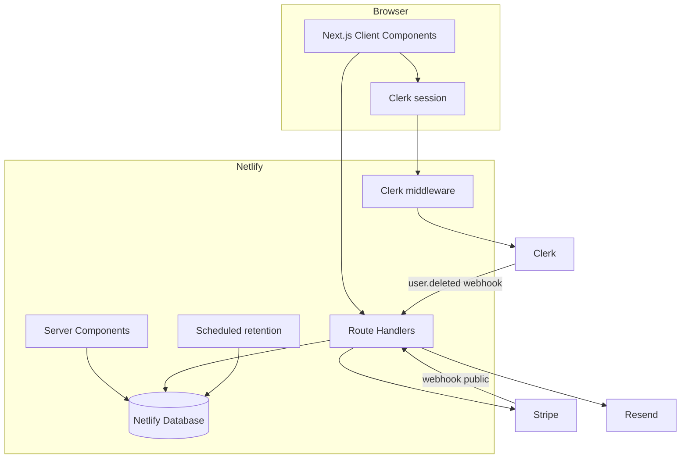

# Unsaid — Implementation Plan

**Status:** Locked for Netlify deployment · gaps closed  
**Stack:** Next.js App Router · Netlify · Netlify Database (Postgres) · Clerk · Stripe · Resend  
**Price:** $29 per couple, one-time · no subscription  
**Tagline:** Before you wed. Check Unsaid.

**Rule:** Everything we build must deploy on Netlify.

Companion docs (do not invent copy or contracts elsewhere):

| Doc | Role |
| --- | --- |
| [COPY.md](./COPY.md) | Screens, emails, tone, errors, principles |
| [API_CONTRACT.md](./API_CONTRACT.md) | Routes, authz, ready vs unlocked, own answers |
| [DATA_MODEL.md](./DATA_MODEL.md) | Tables + migrations |
| [SCORING.md](./SCORING.md) | Algorithm 1.0.0 |
| [PRIVACY.md](./PRIVACY.md) | Invariants |
| [`content/questions/2026.09.json`](../content/questions/2026.09.json) | Full 96-question bank + follow-ups + matrices |

---

## 1. Product

Private, double-blind premarital compatibility check. Two people answer the same 96 questions independently. Server compares (importance + hard lines) and surfaces **conversations worth having**—not marry/don’t-marry advice.

**Transaction moment:**

> Your Unsaid is ready.  
> You have N conversations worth having.  
> Unlock for both · $29

Product principles and tone: [COPY.md](./COPY.md) §1–2.

---

## 2. Locked technical decisions

| Layer | Choice |
| --- | --- |
| Framework | Next.js App Router 15+ (OpenNext on Netlify; do not pin plugin unless required) |
| Auth | Clerk email OTP (`@clerk/nextjs`) |
| DB | Netlify Database (`@netlify/database` + SQL migrations) |
| Answers | AES-256-GCM · server-only · own answers readable by owner |
| Payments | Stripe Checkout + signed webhook · **either participant may pay** |
| Email | Resend |
| Analytics | First-party `analytics_events` table (allowlist only) |
| Rate limits | DB-backed counters |
| Monitoring | Sentry with PII scrubbing |

**Rejected:** Vite SPA shell, Supabase Auth/Postgres, client-side scoring, third-party analytics that ingest mismatch topics.

**Hard rules:**

1. Partner answers never leave the server unless `reveals.status = mutual`.
2. Score once server-side when both complete; store `algorithm_version` + `question_set_version`.
3. Brand string always `Unsaid`.
4. Hard-line authorship never disclosed.
5. Differences are conversations, not failures.

---

## 3. Architecture



**Phase 0 proof (non-negotiable):** On a real Netlify deploy, a Route Handler must successfully call `getDatabase()` from `@netlify/database` (not only a classic `netlify/functions` file). If OpenNext runtime cannot, fall back to thin Netlify Functions for DB ops—but verify before building product UI on a fantasy.

---

## 4. Repository layout

```
/
├── netlify.toml
├── middleware.ts                 # public paths per API_CONTRACT §2
├── app/
│   ├── page.tsx                  # landing
│   ├── privacy|terms|disclaimer/
│   ├── (auth)/sign-in/
│   ├── (app)/dashboard|checks|assessment|results|settings|admin/
│   ├── invite/[token]/
│   ├── questions-before-marriage/ … (7 SEO routes)
│   └── api/…                     # per API_CONTRACT
├── content/questions/2026.09.json
├── components/ · features/ · lib/ · shared/
├── netlify/database/migrations/
├── netlify/functions/retention-cleanup.mts
├── scripts/generate-question-bank.mjs
└── docs/
```

---

## 5. Design system

Tokens (CSS variables): ivory `#FAF7F2`, ink `#181416`, wine `#54263A`, wine-dark `#3F1C2C`, rose `#B8667A`, stone `#EEE9E4`, sage `#6E806F`, ochre `#B47A32`, brick `#A34D46`, warm-gray `#DDD6D0`, white.

Typography: Newsreader (display) + Inter (UI). Mobile type scale per product lock. Buttons 52px / radius 14px. Content max 640px; results desktop 960px. Cards radius 18px; prefer borders over heavy shadows.

Motion: hero fade-rise; answer press; results unlock. Respect `prefers-reduced-motion`.

Assessment: one question per screen; sticky bottom CTA; thumb-sized targets ≥ 44px; browser back works.

---

## 6. Clerk

- Email verification code only (no passwords)
- First name + 18+ in our `profiles`; optional preferred name / pronouns
- Branded custom sign-in (not generic portal chrome)
- `clerkMiddleware` with public paths from [API_CONTRACT.md](./API_CONTRACT.md) §2
- `POST /api/clerk/webhook` on `user.deleted` → same purge as account delete
- Upsert `profiles` on first authenticated request

---

## 7. Database & encryption

`npm install @netlify/database` — auto provision on `netlify dev` / deploy.  
Migrations: `netlify/database/migrations/<number>_<slug>/migration.sql`.

Schema: [DATA_MODEL.md](./DATA_MODEL.md). Includes `analytics_events`, `rate_limits`, follow-up-capable `responses`.

Crypto: per-check DEK wrapped by `ANSWER_MASTER_KEY`; encrypt `{ answer, followUp? }`; importance + hard_line columns for scoring.

---

## 8. Product flows (locked decisions)

**Own answers:** Always readable by the answering participant (assessment GET + results `?include=own`). Not a mutual reveal.

**Results default:** Prompts + classification only; neither answer shown until mutual reveal (own available via explicit control).

**Paywall:** `ready` returns teaser counts only; `unlocked` returns full items. Either participant can start Checkout.

**Follow-ups:** `CP07F` when CP07 ≥ 4; `MO04F` when MO04 ≥ 3. Same screen accordion; stored as linked codes.

**Self-join:** Reject accept if caller is creator.

**Retake:** New check row; never overwrite; still $29 when both complete.

**Mark discussed:** `discussed_at` on `result_items`.

---

## 9. API

Full contract: [API_CONTRACT.md](./API_CONTRACT.md).

Must implement (were previously missing): `GET /api/responses`, discussed, retake, Clerk webhook, health, checkout for either participant, public Stripe webhook.

---

## 10. Phased delivery

### Phase 0 — Deployable foundation
Next.js + Clerk + Netlify Database on a **linked Netlify site**. Design tokens. Migrations for profiles + health. Prove Route Handler `SELECT 1`. Document env. Exit: production URL green.

### Phase 1 — Landing + legal
COPY.md landing · `/privacy` `/terms` `/disclaimer` · analytics `landing_viewed` / `start_clicked` · LCP ~2s.

### Phase 2 — Auth + profile + dashboard shell
OTP · profile upsert · 18+ · dashboard list shape (names, status, date, AI, conversations, delete).

### Phase 3 — Bank + scoring
Ship bank JSON · seed questions · `shared/scoring.ts` unit tests for AG5/ORD/MULTI/CP02/MO02/HL02/hard-line/follow-ups.

### Phase 4 — Checks + invites
Create · invite hash 128-bit · 30-day · Web Share · accept · self-join block · partner lock after B starts · invite email · rate limits.

### Phase 5 — Assessment
Section intros from bank · importance/hard-line UI from COPY · follow-ups · optimistic save + offline queue · waiting + reminder 1/24h · no pre-score.

### Phase 6 — Calculate + Stripe
Both complete → calculate → ready teaser → Checkout (A or B) → webhook unlock → emails.

### Phase 7 — Results + reveal
Headline conversations · Alignment Index · impact list · detail · see my answer · mutual reveal · discussed · retake · viral share · inference honesty copy.

### Phase 8 — Trust
Account/check delete + Clerk webhook · 90-day retention cron · Sentry scrub · a11y (WCAG AA, focus, SR progress, non-color severity labels “Major conversation”) · error states from COPY §16.

### Phase 9 — SEO + PWA + admin
Seven editorial routes · PWA manifest/icons/shell SW · `/admin` funnel + question versions + payment status + refund via Stripe (no plaintext answer browse).

---

## 11. Non-goals (MVP)

AI advice, chat, therapist marketplace, wedding planning, subscriptions, social, dating matching, public scores, native apps, referral discounts, counselor SKU, compare-over-time.

---

## 12. Env

```
NEXT_PUBLIC_CLERK_PUBLISHABLE_KEY
CLERK_SECRET_KEY
CLERK_WEBHOOK_SECRET
NEXT_PUBLIC_CLERK_SIGN_IN_URL=/sign-in
NEXT_PUBLIC_CLERK_SIGN_UP_URL=/sign-in
STRIPE_SECRET_KEY
STRIPE_WEBHOOK_SECRET
STRIPE_PRICE_ID
ANSWER_MASTER_KEY
RESEND_API_KEY
EMAIL_FROM
SENTRY_DSN
NEXT_PUBLIC_SITE_URL
ADMIN_EMAILS
```

---

## 13. Deploy checklist

1. `next build` local OK  
2. Netlify production deploy green  
3. Clerk OTP on deploy URL  
4. Migration applied  
5. Health Route Handler `getDatabase()` works **on that deploy**  
6. Stripe test Checkout + webhook  
7. Middleware: invite + webhooks public; app APIs protected  

Local: prefer `netlify dev` when testing DB.

---

## 14. Testing

| Layer | Focus |
| --- | --- |
| Unit | Distances, CP02, HL02 matrix, encryption, impact sort |
| Contract | Authz matrix, ready vs unlocked shapes, reveal machine, self-join |
| Deploy smoke | Health + Clerk + DB on Netlify |
| Manual | 375–430px, sticky CTA, back button, Web Share, Stripe |

Privacy regressions: partner answers absent; analytics allowlist; hard-line anonymity.

---

## 15. Metrics

**North star:** Paid completed checks  

**Funnel (optimize partner join hardest):** Start → Invite → Both complete → Pay → Results viewed  

Secondary: reveal rate, conversation open, retake, share taps.

Initial targets (directional): landing→start 10–20%; creator complete 70%+; partner join 70%+; partner complete 70%+; pair→pay 40%+.

---

## 16. Definition of done

On a Netlify production URL, a stranger can: Start → Invite → Both assess (96 + follow-ups) → Either pays $29 → Both see conversations + Alignment Index → Mutual reveal → Delete account—with partner answers never exposed except via mutual reveal, and tone that never judges.
